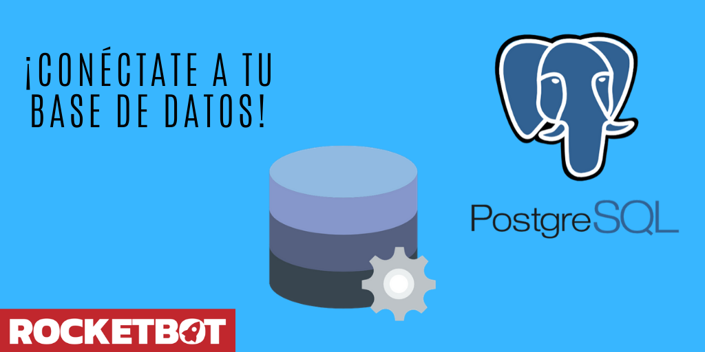

# PostgreSQL
  
Modulo para conectarse a una DB PostgreSQL  
  

## Como instalar este módulo
  
__Descarga__ e __instala__ el contenido en la carpeta 'modules' en la ruta de rocketbot.  

## Como usar este módulo
Para usar este módulo, tienes que tener una base de datos (en la nube o on-premise) ya 
creada.

## Descripción de los comandos

### Conectar BD
  
Conectarse a una BD PostgreSQL
|Parámetros|Descripción|ejemplo|
| --- | --- | --- |
|Hostname|IP o dominio del servidor|localhost|
|Port|Puerto de conexión al servidor|5432|
|Usuario|Usuario de la base de datos|user|
|Contraseña|Contraseña del usuario de la base de datos|******|
|Base de datos|Nombre de la base de datos a conectar|test|
|Asignar a variable|Variable en la cual contener el resultado de la conexión|Variable|

### Ejecutar una query
  
Ejecuta una query hacia la bd PostgreSQL
|Parámetros|Descripción|ejemplo|
| --- | --- | --- |
|Query|Query que se desea ejecutar en la base de datos|SELECT * from table|
|Asignar resultado a variable|Variable en la cual contener el resultado del query|Variable|

### Cerrar Conexión
  
Cierra la conexión a la BD PostgreSQL
|Parámetros|Descripción|ejemplo|
| --- | --- | --- |
||||
